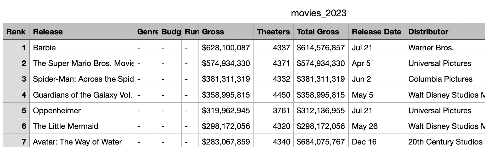
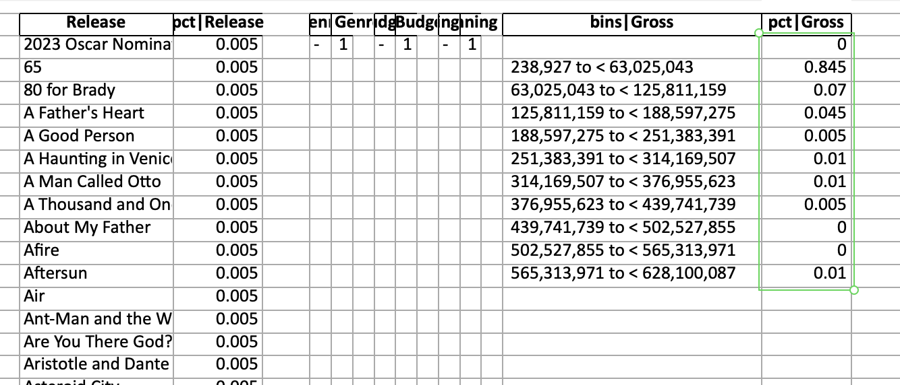

# DataProfiling

Python functions to understand a dataset more quickly.

## Use

```python
from data_profiling import run_field_profiling

file = "movies_2023.csv"

run_field_profiling(file, sort_by="index", normalize=True)
```

This will create a new file "profiled_movies_2023.xlsx"

Raw Data **Before** running profiling


Profiled Data **after** running script


The frequency bins of the "Gross" field allow you to understand distribution quickly in Excel.

Whilst the "Release" field in this dataset does not contain duplicates and therefore might be a bad example, you can see the right hand column would be useful to understand proportions in other tables.

Default is to sort alphabetically, and return percentages/proportions (rather than counts). Play with the settings to get the output you need:

```python
run_field_profiling(file, sort_by="value", normalize=False)
```

# Under the hood

This uses:

- numpy's histogram function to create frequency bins
- pandas's value_counts() function to get the proportions.

# Sample Data

If you're interested, I created a bespoke web scraper to pull data from BoxOfficeMojo. 

- Data Source: [BoxOfficeMojo.com](https://www.boxofficemojo.com/)
- Web Scraper: [georgegoldberg1/scraper_boxoffice_sales](https://github.com/georgegoldberg1/scraper_boxoffice_sales)

You can use it to get US movie sales going back decades (at the time of writing robots.txt file on the site looks ok).

# Authors

George Goldberg (2023)
